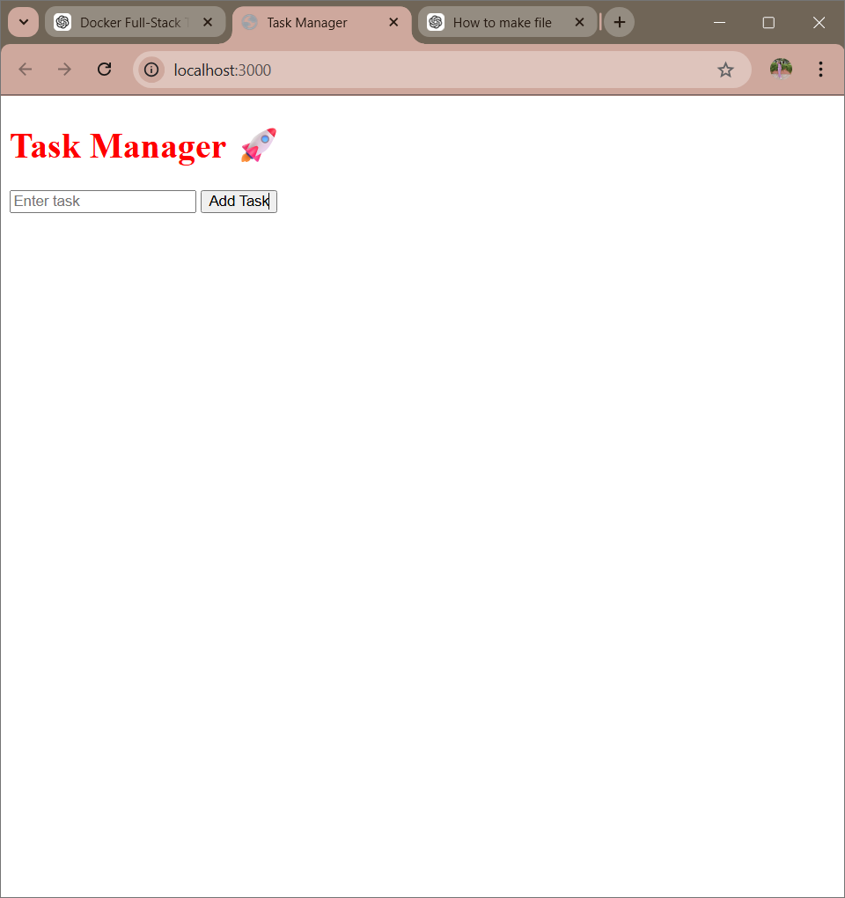
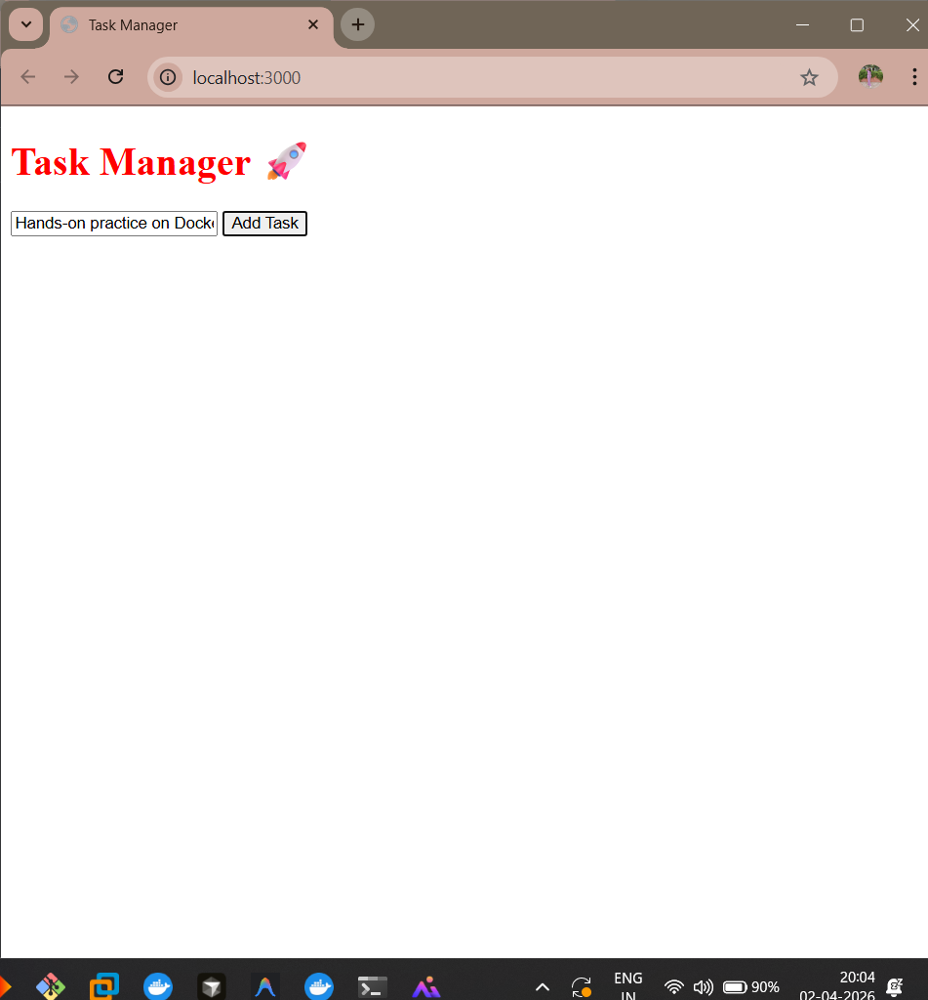

# Dockerized Task Manager

A small full-stack application demonstrating Docker Compose networking, container health checks, and Nginx reverse proxying.

## Architecture

```text
Browser -> Nginx frontend (:3000) -> Node.js API (:5000 internal)
```

The backend is intentionally not published to the host. Nginx forwards `/api/*` requests over the private Compose network.

## Run

```bash
git clone https://github.com/priyanshikothari10/task-manager-docker.git
cd task-manager-docker
docker compose up --build -d
docker compose ps
```

Open http://localhost:3000. Stop the project with `docker compose down`.

## Features

- Add and delete tasks
- Server-side request validation
- Nginx reverse proxy
- Backend health check and dependency ordering
- Multi-stage service isolation through Docker Compose networking

Tasks are stored in memory for this container-networking demo and reset when the backend restarts.

## Screenshots





## Verify

```bash
docker compose config --quiet
curl http://localhost:3000/api/health
```

## Future Improvements

- Persist tasks in PostgreSQL
- Add automated API tests
- Build and publish images with GitHub Actions
- Deploy the stack to AWS

## Author

Priyanshi Kothari - [GitHub](https://github.com/priyanshikothari10) | [LinkedIn](https://www.linkedin.com/in/priyanshi-kothari-93975932a/)
